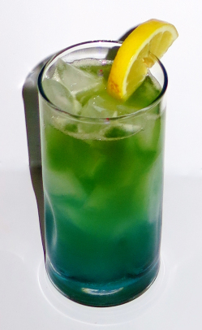
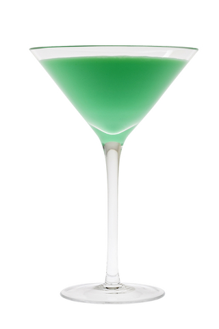
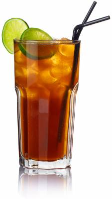
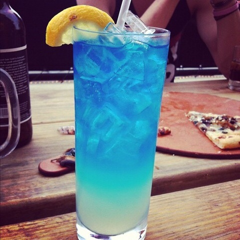
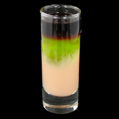
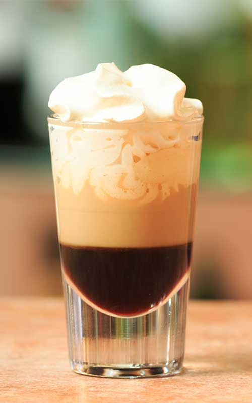
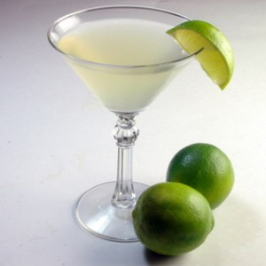
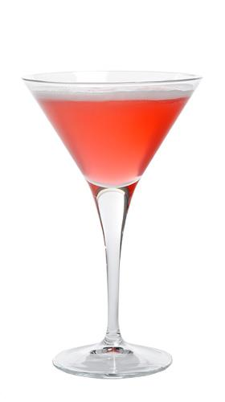
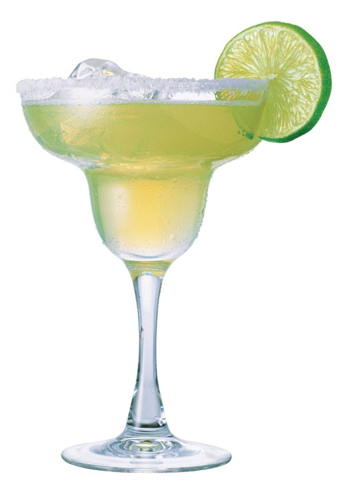
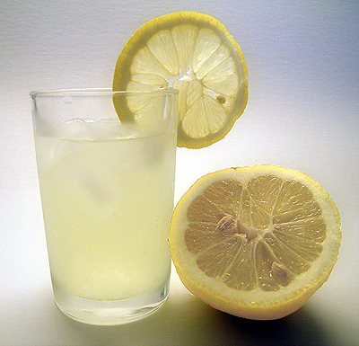

# 음료 목록

## 개요 

### 컨셉

* 보편적인 재료만 들어가고.
* 맛있는. 
* 특이한.

## 칵테일

### 그린 위도우

사진

#### 재료

* 블루 큐라소 - 1oz
* 오렌지 주스 - 1.5oz
* 글라스에 큐브 아이스를 넣어 둔다. (하이볼 글라스나 온더락 글라스를 사용

#### 기법

* 빌드

### 그래스 호퍼 (민트초코우유)

사진

#### 재료 

* 크렘 드 멘트 그린 - 1oz
* 크렘 드 카카오 - 1oz
* 우유 - 1oz

#### 기법

* 하드 쉐이크

### 바나나 우유

#### 재료

* 크렘 드 바나나
* 우유

#### 기법

* 하브 쉐이크

### 피나 콜라다

사진

#### 재료

* 화이트 럼 - 1oz
* 코코넛 크림 - 1oz
* 파인애플 주스 - 3oz

#### 기법

* 블렌드 or 쉐이크

### Long Island Iced Tea

사진

#### 재료

* 드라이 진(술) ½ oz
* 보드카 ½ oz
* 화이트 럼 ½ oz
* 데킬라 ½ oz
* 트리플 섹 ½ oz
* 스윗 앤 사워 믹스 1½ oz
* 콜라 적당량
* 레몬 웻지

### A.M.F (Adios Mother Fucker)

사진

#### 재료

* 드라이 진(술) 15ml
* 보드카 15ml
* 화이트 럼 15ml
* 데킬라 15ml
* 블루 큐라소
* 레몬 주스 혹은 스윗 앤 사워 믹스 30ml
* 검 시럽 1tsp
* 스프라이트 40ml. 칠성사이다로도 대체 가능
* 레몬 슬라이스 한장

#### 기법

* 빌드

### 퀵 퍽

사진

#### 재료

* 깔루아 15ml
* 베일리스 15ml
* 미도리 15ml

#### 기법

* 플로팅

### BJ  

사진

#### 재료

* 깔루아
* 베일리스
* 생크림

#### 기법

* 플로팅

### 다이키리

사진

#### 재료

* 화이트 럼 - 1¾ oz
* 생 라임 주스 - ¾ oz
* 시럽 - ½ oz 또는 설탕 1tsp

#### 기법

* 쉐이크

### 바카디 (핑크 다이키리)

사진

#### 재료

* 바카디 슈페리어 50ml
* 레몬 주스 20ml
* 그레나딘 시럽 1스푼 (약 5ml)

#### 기법

* 쉐이크

### 마가리타 

사진

#### 재료

* 데킬라 - 1oz (30ml)
* 트리플 섹 - 1/2oz (15ml)
* 라임 주스 - 1/2oz (15ml)

#### 기법

* 쉐이크
* 라임즙,소금 리밍.

## 논 알콜 칵테일

### 레모네이드

사진

#### 재료

* 레몬즙
* 설탕
* 탄산수

#### 기법

* 빌드
