# 음료 목록

## 개요 

* [개요](##개요)
* [데킬라](##데킬라)
* [보드카](##보드카)
* [아구아](##아구아)
* [맥주 베이스](##맥주_베이스)
* [위스키](##위스키)
* [럼](##럼)
* [예거](##에거)
* [깔루아](##깔루아)
* [기타 칵테일](##기타_칵테일)
* [등등..](##등등..)
* [논 알콜 칵테일](##논_알콜_칵테일)

### 컨셉

* 보편적인 재료만 들어가고.
* 맛있는. 
* 특이한.

## 데킬라

### 데킬라 선라이즈

사진

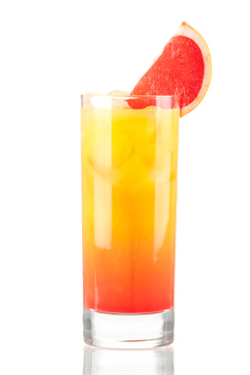

#### 재료

> * 데킬라 1.5 oz
> * 오렌지 주스
> * 그레나딘 시럽 0.5 oz
> * 필스너 글라스

#### 만드는 법 

> 1. 잔에 얼음 2~3개를 넣는다.
> 1. 데킬라 → 오렌지 주스를 따르고 가볍게 저어준다.
> 1. 그 다음엔 그레나딘 시럽을 플로팅-살짝 부으면 천천히 밑으로 가라앉는데, 이대로 내어주면 취향에 따라 섞거나 스트로로 빨아 마시면 된다.

### 데킬라 슬래머 (샷건)

사진

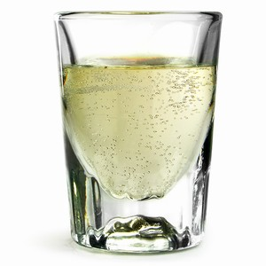

#### 만드는 법

> 스트레이트 글라스(혹은 스트레이트 더블 글라스)에 데킬라를 반 채우고, 나머지를 탄산수[1]로 채운 후 손으로 덮어 테이블에 강하게 내리친 후 단번에 비우는 방식이다.

### 데킬라 스톤 사워

사진

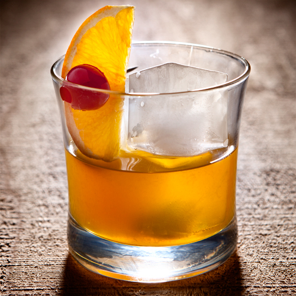

#### 재료

> * 데킬라 30ml
> * 트리플 섹 30ml
> * 오렌지 주스 30ml
> * 스위트 앤 사우어 1방울
>> 스위트 앤 사우어 :레몬주스와 라임주스 1:1로 섞기

#### 만드는 법

재료를 모두 쉐이커에 넣어 적당히 믹스 한 후, 칵테일 글래스에 담아서 완성.

### 데킬라 토닉

사진

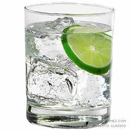

#### 재료

> * 데킬라 75ml
> * 토닉워터 150ml

#### 만드는 법

> 1. 재료를 모두 하이볼 글래스에 넣고 섞는다.
> 1. 레몬으로 장식하여 완성.

### 마가리타 

사진

#### 재료

* 데킬라 - 1oz (30ml)
* 트리플 섹 - 1/2oz (15ml)
* 라임 주스 - 1/2oz (15ml)

#### 기법

* 쉐이크
* 라임즙,소금 리밍.

### 선 번

사진

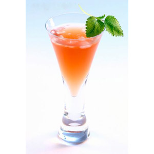

#### 재료

> * 데킬라 블랑코 37.5ml (화이트 데킬라)
> * 트리플 섹 30ml
> * 크랜베리 주스 90ml

#### 만드는 법

재료를 모두 하이볼 글래스에 넣고 섞어주면 완성.

### 싱코 데 마요

사진

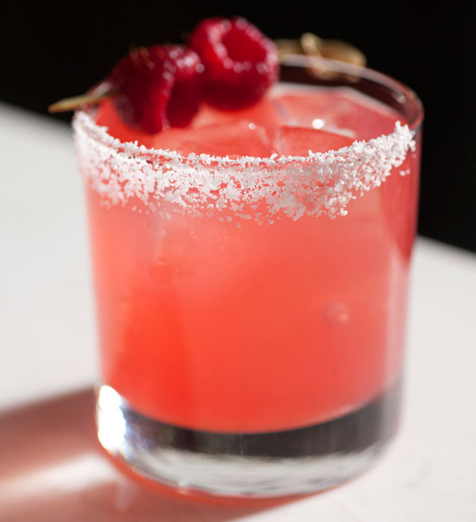

#### 재료

> * 데킬라 블랑코 75ml (화이트 데킬라)
> * 그레나딘 시럽 30ml
> * 라임 주스 30ml

#### 만드는 법

재료를 믹싱 글래스에 넣고 섞은 후 칵테일 글래스에 담아서 완성.

### 아이스브레이커

사진

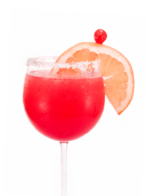

#### 재료

> * 데킬라 1oz
> * 자몽주스 1oz
> * 트리플섹 1ts (티스푼)
> * 그레나딘 시럽 1ts (티스푼)
> * 얼음과 함께 쉐이크
> * 락 글래스

#### 만드는 법

없는듯. 잘 섞으면 되는듯.

### 엘 토로

사진

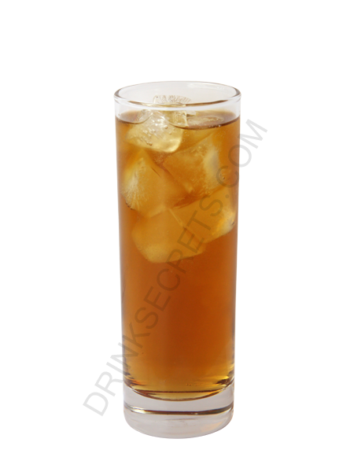

#### 재료

> * 데킬라 블랑코 60ml (화이트 데킬라)
> * 깔루아 30ml

#### 만드는 법

쉐이커에 재료를 넣고 잘 섞은후 칵테일 글래스에 따라서 완성.

## 엘 토로 로코

#### 재료

> * 데킬라 30ml
> * 레드불 90ml

#### 만드는 법 

재료를 하이볼 글래스에 붓고 섞는다.

### 치마요

사진

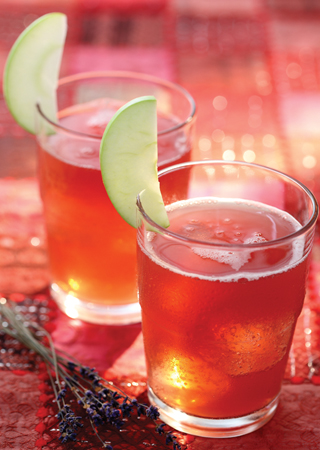

#### 재료

> * 데킬라 45ml
> * 사이다 30ml

#### 만드는 법

> 1. 하이볼 글래스에 재료를 넣고 섞어준다.
> 1. 사과 조각으로 장식하여 완성.

### 팔로마

사진

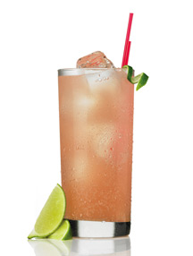

#### 재료 1

> * 데킬라 60ml
> * 클럽 소다 180ml
> * 라임 주스 1방울
> * 소금 0.5 티스푼

#### 재료 2 

> * 데킬라 블랑코 60ml (화이트 데킬라)
> * 라임 주스 15ml
> * 시트러스 소다 120ml (사이다로 대체가능)
> * 소금 1 티스푼

#### 만드는 법

> 1. 재료 1이나 재료 2를 하이볼 글래스에 넣고 섞어준다.
> 1. 라임으로 장식하여 완성.

## 보드카

### 스크류드라이버

사진

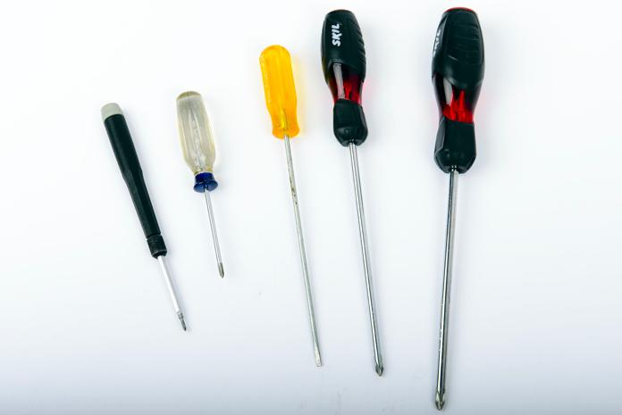

#### 재료

> * 보드카 1온스~1½온스
> * 오렌지 주스 적당량

#### 만드는 법

만드는 법은 초간단. 보드카를 얼음을 채운 하이볼 글라스에 따른 후 오렌지 주스를 그 위에 부어주고 간단히 섞으면 된다.

### 블랙러시안

사진

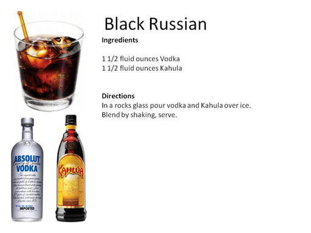

#### 재료

> * 보드카 1 oz 
> * 깔루아 1/2 oz

#### 만드는법 

저어서 섞는 것이 기본이지만, 깔루아가 보드카에 비해 걸쭉하고 무거워서 아래로 가라앉기 때문에, 깔루아를 먼저 넣고 젓지 않는 사람도 있다

### 화이트러시안

사진

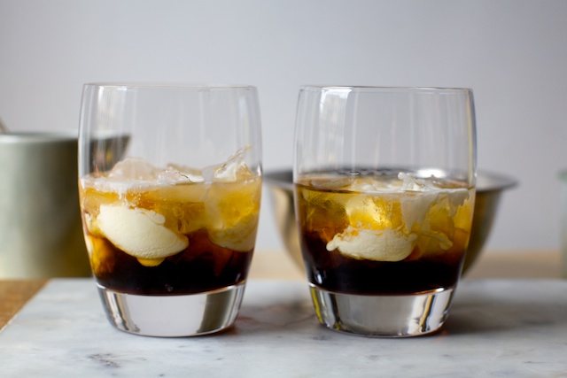

#### 재료

> * 보드카 : 50ml
> * 커피 리큐르 : 20ml
> * 생크림 : 30ml

#### 만드는 법

1. 잔에 보드카→커피 리큐르 순서로 따르고, 그 위에 생크림을 조심스레 부어서 층이 지게 해준다. 
1. 이 상태에서 살짝 저어서 섞어주면 완성. 
1. 장식은 원래 없다.

> * 온스 단위로 할 경우 보드카 1½oz, 커피리큐르 ½oz, 우유 1oz 로 추천되는 듯하다. 비율을 조금씩 바꿔보며 자신의 입맛을 찾아보자.

> * 젓지 않을 경우 약간의 층이 생겨서 보기에 좋다. 이러면 젓는 건 손님의 몫

>  * 크림을 구하기 힘든 국내에서는 그냥 우유로 대체되기도 한다. 다만 이러면 부드러운 맛이 상당히 줄어든다.

### Long Island Iced Tea

사진

#### 재료

* 드라이 진(술) ½ oz
* 보드카 ½ oz
* 화이트 럼 ½ oz
* 데킬라 ½ oz
* 트리플 섹 ½ oz
* 스윗 앤 사워 믹스 1½ oz
* 콜라 적당량
* 레몬 웻지

### A.M.F (Adios Mother Fucker)

사진

#### 재료

* 드라이 진(술) 15ml
* 보드카 15ml
* 화이트 럼 15ml
* 데킬라 15ml
* 블루 큐라소
* 레몬 주스 혹은 스윗 앤 사워 믹스 30ml
* 검 시럽 1tsp
* 스프라이트 40ml. 칠성사이다로도 대체 가능
* 레몬 슬라이스 한장

#### 기법

* 빌드

### 카미카제

사진

#### 재료

> * 보드카 - 30ml
> * 트리플 섹 - 15ml
> * 라임 주스 - 15ml[1]
> * 기법: 쉐이크

#### 만드는 법

재료를 얼음을 채운 셰이커에 붓고 잘 흔들어준 후 글라스에 따른다.

### 슬렛지 해머

사진

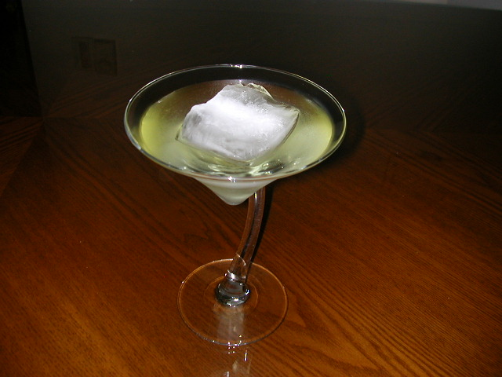

#### 재료

> * 기법 - 쉐이크
> * 보드카 - 1 1/2oz
> * 라임 주스 - 1/2oz
> * 얼음

#### 만드는 법

쉐이크하여 칵테일 글라스에 따른 후 얼음을 넣는다.
> 유래나 출전은 불분명. 따라서 정석이 정해져 있는 칵테일이라고는 할 수 없다.

### 모스코 뮬

사진

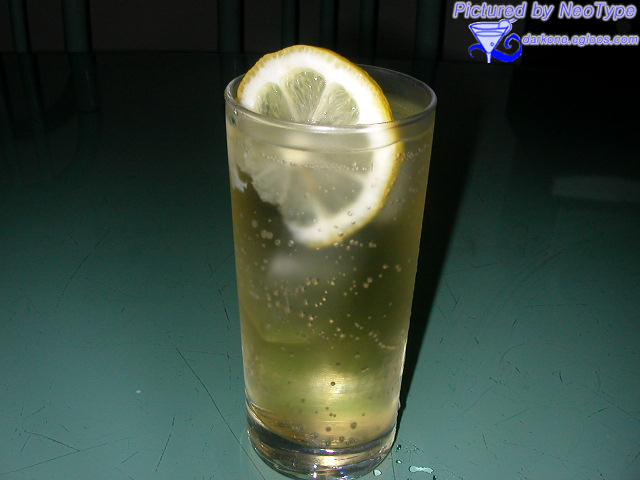

#### 재료

> * 보드카 30~45ml
> * 레몬 or 라임 주스 15ml
> * 진저 비어 적당~히(보드카와 주스를 섞은 뒤 잔을 넉넉히 채울 정도로) (없다면 진저 에일)
> * 장식용 레몬 or 라임 슬라이스

#### 만드는 법

1. 구리 머그잔에 큼직한 얼음 2~3개를 넣는다.
1. 보드카를 우선 위에 따르고, 그 뒤 레몬 or 라임주스를 넣는다.
1. 나머지는 차갑게 만든 진저 비어를 채우고 살짝 저은 뒤 즐긴다.

## 아구아

### 아구아 밤

사진

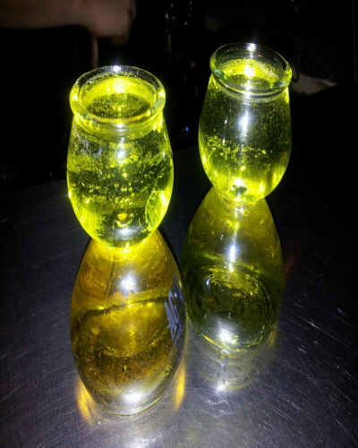

#### 재료

> * 아구아
> * 에너지 드링크
> * 전용잔

#### 만드는법

잘 딴다.

## 맥주_베이스

### 레드아이

사진

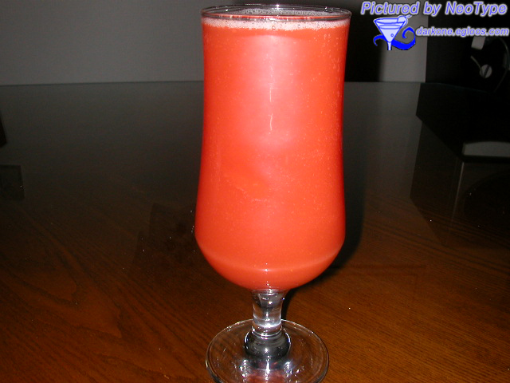

#### 재료

> * 맥주 1
> * 토마토 주스 1

#### 만드는 법

 제조 법은 초간단이며 차게 식힌 맥주와 토마토 주스를 1:1 비율로 섞어 만드는 칵테일이다. 기법은 빌드로 재료를 잔에 넣고 저어주면 된다. 다만 토마토 주스가 무겁기 때문에 많이 저어주어야 한다. 

### 블렉벨벳

사진

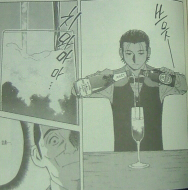

#### 재료

* 샴페인 - 1/2
* 흑맥주 - 1/2

#### 기법

* 빌드
* 동시에 붓기

## 위스키

### 잭콕

사진

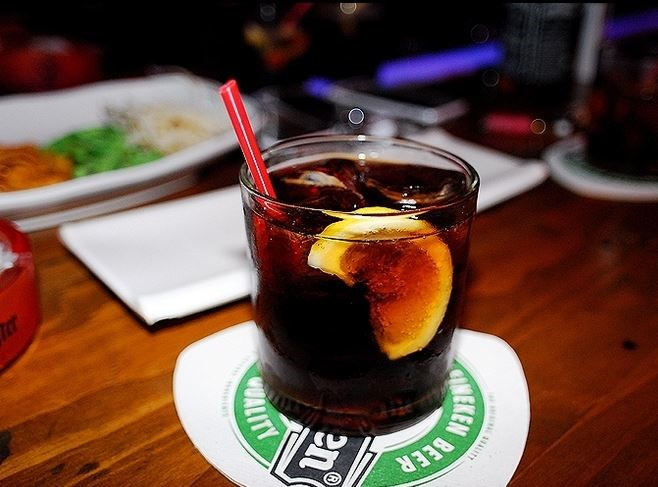

#### 재료

> * 잭 다니엘 - 1 1/2oz
> * 콜라 - 적당량
> * 온더락 글라스에 얼음을 넣어 둔다.

#### 만드는 법

 재료를 글라스에 차례로 붓고 살짝 섞어 준다. 이때 위스키를 먼저 넣고 콜라를 넣는 순서를 거꾸로 하지 않도록 유의. 거의 모든 칵테일은 스피리트부터 넣는다. 이것은 비중 때문인데, 시럽보다는 음료가, 음료보다는 스피리트가 가볍기 때문이다. 따라서 만일 잭콕을 만들 때 콜라를 먼저 넣고 위스키를 나중에 넣는다면 위스키만 위쪽에 둥둥 떠 있게 된다. 위스키랑 콜라를 따로 맛보고 싶다면 시도해도 상관은 없겠지만 그 때부터는 더 이상 잭콕이 아니게 된다.

## 럼

### 피나 콜라다

사진

#### 재료

* 화이트 럼 - 1oz
* 코코넛 크림 - 1oz
* 파인애플 주스 - 3oz

#### 기법

* 블렌드 or 쉐이크

### 다이키리

사진

#### 재료

* 화이트 럼 - 1¾ oz
* 생 라임 주스 - ¾ oz
* 시럽 - ½ oz 또는 설탕 1tsp

#### 기법

* 쉐이크

### 바카디 (핑크 다이키리)

사진

#### 재료

* 바카디 슈페리어 50ml
* 레몬 주스 20ml
* 그레나딘 시럽 1스푼 (약 5ml)

#### 기법

* 쉐이크

## 예거

### 예거밤(맥주)

사진

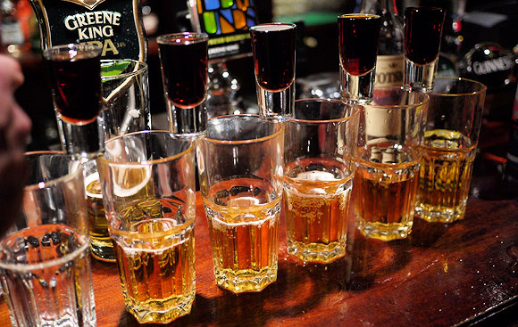

#### 재료
> * 예거마이스터 1샷
> * 맥주or에너지드링크 500ml(1 핀트, 맥주면 되도록 라거)

#### 만드는 법

핀트잔에다 맥주/에너지드링크를 끝까지 채운뒤 예거마이스터를 샷잔에 꽉 채워 떨어뜨린다. 폭탄주와 제작법 동일.

## 깔루아

### B-52

사진

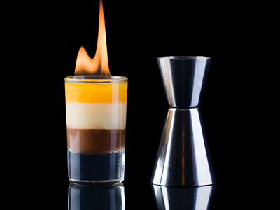

#### 재료

* 깔루아 - 1/3
* 베일리스 - 1/3
* 그랑 마르니에 - 1/3

#### 기법

* 플로팅

### 퀵 퍽

사진

#### 재료

* 깔루아 15ml
* 베일리스 15ml
* 미도리 15ml

#### 기법

* 플로팅

### BJ  

사진

#### 재료

* 깔루아
* 베일리스
* 생크림

#### 기법

* 플로팅

## 기타_칵테일

### 그린 위도우

사진

#### 재료

* 블루 큐라소 - 1oz
* 오렌지 주스 - 1.5oz
* 글라스에 큐브 아이스를 넣어 둔다. (하이볼 글라스나 온더락 글라스를 사용

#### 기법

* 빌드

### 그래스 호퍼 (민트초코우유)

사진

#### 재료 

* 크렘 드 멘트 그린 - 1oz
* 크렘 드 카카오 - 1oz
* 우유 - 1oz

#### 기법

* 하드 쉐이크

### 바나나 우유

#### 재료

* 크렘 드 바나나
* 우유

#### 기법

* 하브 쉐이크

## 등등..

### 아무거나 위스키

### 스미노프 사과

### 민슬레 머포

### 이백집 소주

### 파이어볼

## 논_알콜_칵테일

### 레모네이드

사진

#### 재료

* 레몬즙
* 설탕
* 탄산수

#### 기법

* 빌드

### 신데렐라

사진

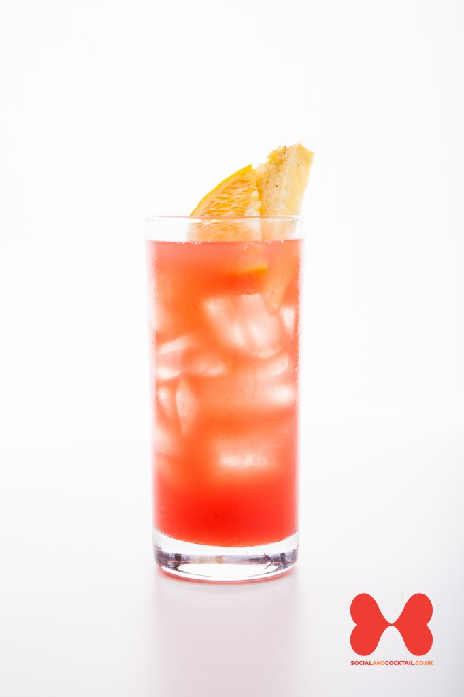

#### 재료

> * 레몬 주스 - 20ml
> * 오렌지 주스 - 20ml
> * 파인애플 주스 - 20ml

#### 만드는 법

 쉐이크 후 칵테일 글라스에 따른다.

## 플로리다 자몽

사진

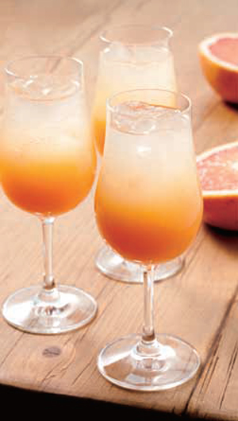

#### 재료

> * 플로리다 내추럴 자몽 주스 200mL
> * 플로리다 내추럴 오렌지 주스 50mL
> * 탄산수 50mL 
 
#### 만드는 법

플로리다 내추럴 자몽 주스, 플로리다 내추럴 오렌지 주스, 탄산수를 고루 섞어 잔에 담는다. 

## 선라이즈

#### 재료

> * 오렌지 주스
> * 그레나딘 시럽 0.5 oz

#### 만드는 법

> 1. 잔에 얼음 2~3개를 넣는다.
> 1. 오렌지 주스를 따르고 가볍게 저어준다.
> 1. 그 다음엔 그레나딘 시럽을 플로팅-살짝 부으면 천천히 밑으로 가라앉는데, 이대로 내어주면 취향에 따라 섞거나 스트로로 빨아 마시면 된다.

### 셜리 템플

#### 재료

> * 그레나딘 시럼 1tsp
> * 진저에일
> * 얼음

#### 만드는법

> 1. 텀블러에 그레나딘 시럽 1tsp와 얼음을 넣은후 진저 에일로 채운후, 가볍게 젓는다.
> 1. 잘 섞인 칵테일은 잔에 따르고 레몬 슬라이스로 장식한다.
