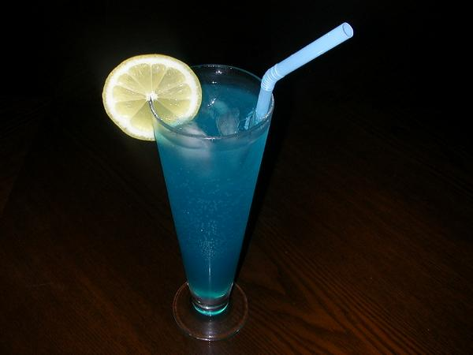
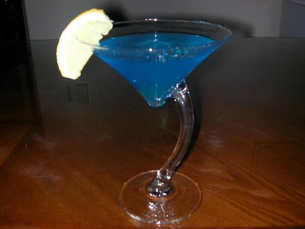
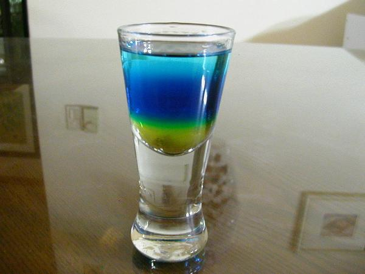
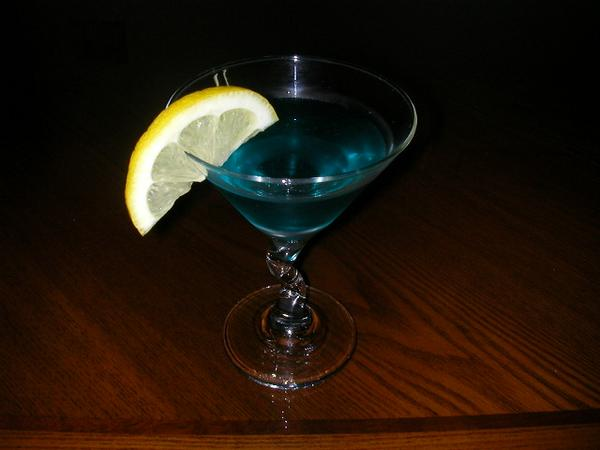
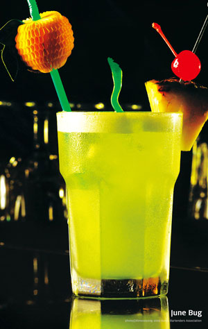
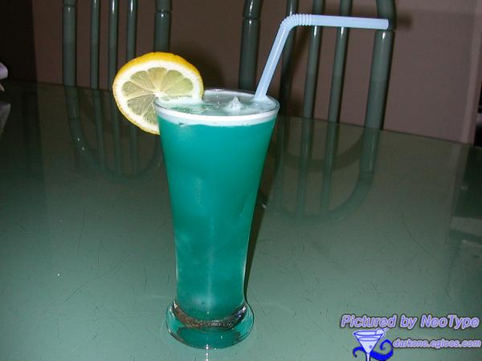
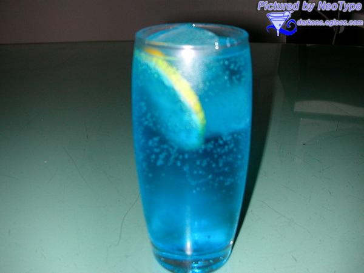
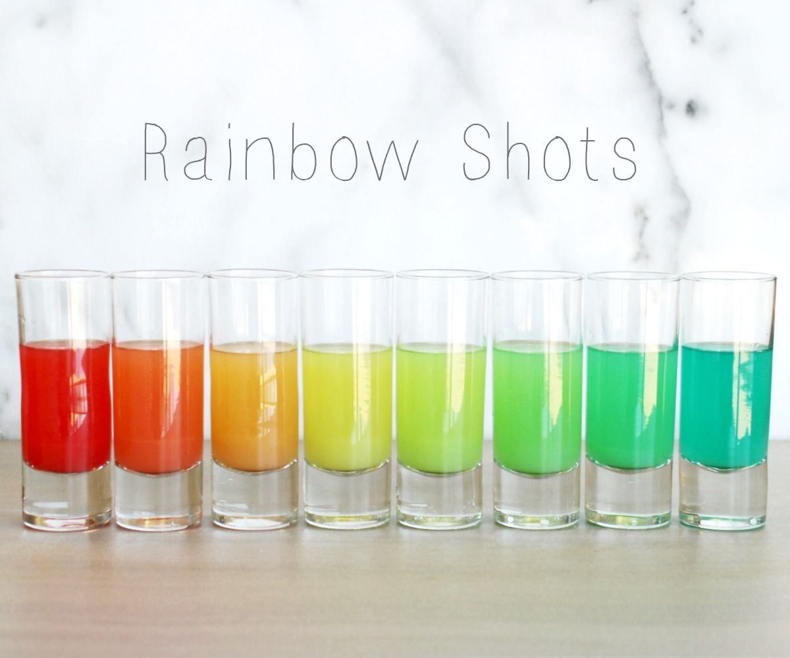
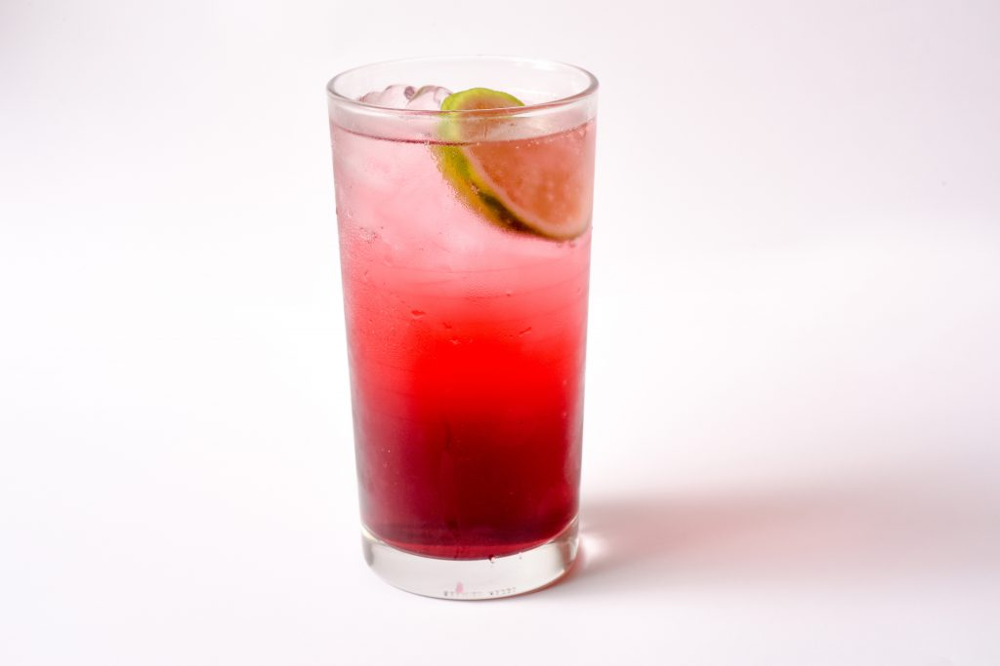

# 음료 목록

## 개요 

* [개요](#개요)
* [데킬라](#데킬라)
* [보드카](#보드카)
* [아구아](#아구아)
* [맥주 베이스](#맥주_베이스)
* [위스키](#위스키)
* [럼](#럼)
* [예거](#에거)
* [깔루아](#깔루아)
* [기타 칵테일](#기타_칵테일)
* [등등..](#등등..)
* [논 알콜 칵테일](#논_알콜_칵테일)

### 컨셉

* 보편적인 재료만 들어가고.
* 맛있는. 
* 특이한.

## 데킬라

### 데킬라 선라이즈

사진

#### 재료

* 데킬라 1.5 oz
* 오렌지 주스
* 그레나딘 시럽 0.5 oz
* 필스너 글라스

#### 기법

* 빌드
* 플로팅

#### 특징

* 8-10도

### 데킬라 슬래머 (샷건)

사진

#### 만드는 법

> 스트레이트 글라스(혹은 스트레이트 더블 글라스)에 데킬라를 반 채우고, 나머지를 탄산수로 채운 후 손으로 덮어 테이블에 강하게 내리친 후 단번에 비우는 방식이다.

#### 특징

* 20도 정도

### 데킬라 스톤 사워

사진

#### 재료

* 데킬라 30ml
* 트리플 섹 30ml
* 오렌지 주스 30ml
* 스위트 앤 사우어 1방울

#### 기법

* 쉐이크

#### 특징

* 20-25도
* 기억 안남

### 데킬라 토닉

사진

#### 재료

* 데킬라 75ml
* 토닉워터 150ml

#### 기법

* 빌드
* 레몬 가니시

#### 특징

* 10-15도
* 데킬라 맛이랑 토닉맛이 남.
* 완전 가벼운 맛은 아님.

### 마가리타 

사진

#### 재료

* 데킬라 - 1oz (30ml)
* 트리플 섹 - 1/2oz (15ml) 
* 라임 주스 - 1/2oz (15ml)

#### 기법

* 쉐이크
* 라임즙,소금 리밍.

#### 특징

* 25-30도
* 트리플섹 대신 살구 리큐르 쓰면 살구맛 남.
* 트리플섹 대신 블루 큐라소 쓰면 블루 마가리타.
* 알코올 향이 나는데.
* 도수에 비해선 가벼움.

### 선 번

사진

#### 재료

* 데킬라 블랑코 37.5ml (화이트 데킬라)
* 트리플 섹 30ml
* 크랜베리 주스 90ml

#### 기법

* 하이볼 글라스
* 빌드

#### 특징

* 15-18도

### 싱코 데 마요

사진

#### 재료

* 데킬라 블랑코 75ml (화이트 데킬라)
* 그레나딘 시럽 30ml
* 라임 주스 30ml

#### 만드는 법

재료를 믹싱 글래스에 넣고 섞은 후 칵테일 글래스에 담아서 완성.

#### 특징

* 20-23도

### 아이스브레이커

사진

#### 재료

* 데킬라 1oz
* 자몽주스 1oz
* 트리플섹 1ts (티스푼)
* 그레나딘 시럽 1ts (티스푼)
* 얼음과 함께 쉐이크
* 락 글래스

#### 기법

* 쉐이크 or 빌드

#### 특징

* 15-20도

### 엘 토로

사진

#### 재료

* 데킬라 블랑코 60ml (화이트 데킬라)
* 깔루아 30ml

#### 기법

* 쉐이트

#### 특징

* 30도쯤

## 엘 토로 로코

#### 재료

* 데킬라 30ml
* 레드불 90ml

#### 기법

* 하이볼 글라스
* 빌드

#### 특징

* 10도쯤

### 치마요

사진

#### 재료

* 데킬라 45ml
* 사이다 30ml

#### 만드는 법

1. 하이볼 글래스에 재료를 넣고 섞어준다.
1. 사과 조각으로 장식하여 완성.

#### 특징

* 20-25도

### 팔로마

사진

#### 재료 1

* 데킬라 60ml
* 클럽 소다 180ml
* 라임 주스 1방울
* 소금 0.5 티스푼

#### 재료 2 

* 데킬라 블랑코 60ml (화이트 데킬라)
* 라임 주스 15ml
* 시트러스 소다 120ml (사이다로 대체가능)
* 소금 1 티스푼

#### 만드는 법

1. 재료 1이나 재료 2를 하이볼 글래스에 넣고 섞어준다.
1. 라임으로 장식하여 완성.

#### 특징

* 10-15도

## 보드카

### 스크류드라이버

사진

#### 재료

* 보드카 1온스~1½온스
* 오렌지 주스 적당량

#### 만드는 법

만드는 법은 초간단. 보드카를 얼음을 채운 하이볼 글라스에 따른 후 오렌지 주스를 그 위에 부어주고 간단히 섞으면 된다.

#### 특징

* 8-10도
* 걍 오렌지 주스 맛.

### 블루 라군

사진

#### 재료

* 보드카 - 30ml
* 블루 큐라소 - 15ml
* 레몬 주스 - 15ml
* 설탕 - 2tsps
* 탄산수 - 적당량

#### 기법

* 쉐이크

#### 특징

* 15도쯤.

### 블루 먼데이

사진

#### 재료

* 보드카 - 45ml
* 트리플 섹 - 15ml
* 블루 큐라소 - 15ml

#### 기법

* 쉐이크

#### 특징

* 35도쯤

### 블루 스카이

사진

#### 재료

* 라임 주스 - 10ml
* 블루 큐라소 - 10ml
* 보드카 - 10ml

#### 기법

* 플로트.

#### 특징

* 20-25도

### 블랙러시안

사진

#### 재료

* 보드카 1 oz 
* 깔루아 1/2 oz

#### 만드는법 

저어서 섞는 것이 기본이지만, 깔루아가 보드카에 비해 걸쭉하고 무거워서 아래로 가라앉기 때문에, 깔루아를 먼저 넣고 젓지 않는 사람도 있다

#### 특징

* 20-30도 (비율에 따라.)
* 쓴데 담.

### 화이트러시안

사진

#### 재료

* 보드카 : 50ml
* 커피 리큐르 : 20ml
* 생크림 : 30ml

#### 만드는 법

1. 잔에 보드카→커피 리큐르 순서로 따르고, 그 위에 생크림을 조심스레 부어서 층이 지게 해준다. 
1. 이 상태에서 살짝 저어서 섞어주면 완성. 
1. 장식은 원래 없다.

* 온스 단위로 할 경우 보드카 1½oz, 커피리큐르 ½oz, 우유 1oz 로 추천되는 듯하다. 비율을 조금씩 바꿔보며 자신의 입맛을 찾아보자.

* 젓지 않을 경우 약간의 층이 생겨서 보기에 좋다. 이러면 젓는 건 손님의 몫

* 크림을 구하기 힘든 국내에서는 그냥 우유로 대체되기도 한다. 다만 이러면 부드러운 맛이 상당히 줄어든다.

#### 특징

* 20-25도쯤
* 쓴데 단데 우유맛.

### Long Island Iced Tea

사진

#### 재료

* 드라이 진(술) ½ oz
* 보드카 ½ oz
* 화이트 럼 ½ oz
* 데킬라 ½ oz
* 트리플 섹 ½ oz
* 스윗 앤 사워 믹스 1½ oz
* 콜라 적당량
* 레몬 웻지

#### 특징

* 10-20도
* 아이스티맛 남.
* 소주랑 도수 비슷한데 훨신 편한 음료수임.

### A.M.F (Adios Mother Fucker)

사진

#### 재료

* 드라이 진(술) 15ml
* 보드카 15ml
* 화이트 럼 15ml
* 데킬라 15ml
* 블루 큐라소
* 레몬 주스 혹은 스윗 앤 사워 믹스 30ml
* 검 시럽 1tsp
* 스프라이트 40ml. 칠성사이다로도 대체 가능
* 레몬 슬라이스 한장

#### 기법

* 빌드

#### 특징

* 10-20도
* 위에거랑 비슷함.

### 카미카제

사진

#### 재료

* 보드카 - 30ml
* 트리플 섹 - 15ml
* 라임 주스 - 15ml
* 기법: 쉐이크

#### 만드는 법

재료를 얼음을 채운 셰이커에 붓고 잘 흔들어준 후 글라스에 따른다.

#### 특이사항

* 트리플섹 대신 블루 큐라소 쓰면 이뻐짐.

#### 특징

* 25-30도
* 알콜향 생각보다 강함.
* 가끔 겁나 맛있을때 있음.

### 슬렛지 해머

사진

#### 재료

* 기법 - 쉐이크
* 보드카 - 1 1/2oz
* 라임 주스 - 1/2oz
* 얼음

#### 만드는 법

쉐이크하여 칵테일 글라스에 따른 후 얼음을 넣는다.
> 유래나 출전은 불분명. 따라서 정석이 정해져 있는 칵테일이라고는 할 수 없다.

#### 특징

* 25-30도.

### 모스코 뮬

사진

#### 재료

* 보드카 30~45ml
* 레몬 or 라임 주스 15ml
* 진저 비어 적당~히(보드카와 주스를 섞은 뒤 잔을 넉넉히 채울 정도로) (없다면 진저 에일)
* 장식용 레몬 or 라임 슬라이스

#### 만드는 법

1. 구리 머그잔에 큼직한 얼음 2~3개를 넣는다.
1. 보드카를 우선 위에 따르고, 그 뒤 레몬 or 라임주스를 넣는다.
1. 나머지는 차갑게 만든 진저 비어를 채우고 살짝 저은 뒤 즐긴다.

#### 특징

* 10-20도(비율에 따라.)
* 진저비어, 라임 쓰면 맛있음.

## 아구아

### 아구아 밤

사진

#### 재료

* 아구아
* 에너지 드링크
* 전용잔

#### 만드는법

잘 딴다.

#### 특징

* 아구아 30도밖에 안됨.
* 대충 3:1이라서 합치면 7-8도 이긴함.

## 맥주_베이스

### 레드아이

사진

#### 재료

* 맥주 1
* 토마토 주스 1

#### 만드는 법

 제조 법은 초간단이며 차게 식힌 맥주와 토마토 주스를 1:1 비율로 섞어 만드는 칵테일이다. 기법은 빌드로 재료를 잔에 넣고 저어주면 된다. 다만 토마토 주스가 무겁기 때문에 많이 저어주어야 한다. 

#### 특징

* 그냥 토마토 주스임.
* 2-3도
* 맥주는 라거가 좋고 해장술로 많이씀.

### 블렉벨벳

사진

#### 재료

* 샴페인 - 1/2
* 흑맥주 - 1/2

#### 기법

* 빌드
* 동시에 붓기

#### 특징 

* 5-8도
* 맥주 이상의 맥주, 샴페인 이상의 샴페인. 그리고 그야말로 블랙 벨벳같은 맛.

## 위스키

### 잭콕

사진

#### 재료

* 잭 다니엘 - 1 1/2oz
* 콜라 - 적당량
* 온더락 글라스에 얼음을 넣어 둔다.

#### 만드는 법

 재료를 글라스에 차례로 붓고 살짝 섞어 준다. 이때 위스키를 먼저 넣고 콜라를 넣는 순서를 거꾸로 하지 않도록 유의. 거의 모든 칵테일은 스피리트부터 넣는다. 이것은 비중 때문인데, 시럽보다는 음료가, 음료보다는 스피리트가 가볍기 때문이다. 따라서 만일 잭콕을 만들 때 콜라를 먼저 넣고 위스키를 나중에 넣는다면 위스키만 위쪽에 둥둥 떠 있게 된다. 위스키랑 콜라를 따로 맛보고 싶다면 시도해도 상관은 없겠지만 그 때부터는 더 이상 잭콕이 아니게 된다.

#### 특징

* 10-15도.
* 생각보다는 별로임.
* 코카콜라가 훨신 좋음.

## 럼

### 스카이 다이빙

사진

#### 재료

* 화이트 럼 - 30ml
* 블루 큐라소 - 15ml
* 라임 주스 - 15ml

#### 기법

* 셰이크

#### 특징

* 25-28도.

### 준벅

사진

#### 재료

* 미도리 30ml (멜론 리큐르로 대체 가능)
* 말리부 코코넛 럼 15ml
* 크렘 드 바나나 15ml (바나나 리큐르로 대체 가능)
* 스윗 앤 사워 믹스 30ml
* ~~검 시럽 15ml~~
* 파인애플 주스 15ml

> * 조주기능사에서는 검 시럽 없이 스윗 앤 사워 믹스와 파인애플 주스가 각각 60ml(2oz)씩 들어간다.

#### 기법

* 쉐이크

### 피나 콜라다

사진

#### 기법

* 화이트 럼 - 1oz
* 코코넛 크림 - 1oz
* 파인애플 주스 - 3oz

#### 재료

* 블렌드 or 쉐이크

#### 특징

* 6-8도.
* 달달함.

### 블루 하와이

사진

#### 재료 1

* 럼 - 30ml
* 블루 큐라소 - 15ml
* 라임 주스 - 15ml
* 파인애플 주스 - 30ml

#### 재료 - 블루 하와이안.

* 라이트 럼 1 oz
* 블루 큐라소 1 oz
* 코코넛 플레이버드 럼 1 oz //코코넛 크림으로 대체해보자.
* 파인애플 주스 2 ½ oz

#### 기법

* 블렌드 or 셰이크

#### 특징

* 30도쯤.

### 페인 킬러

사진

#### 재료

* 럼 2 oz
* 파인에플 주스 4 oz
* 오렌지 주스 1 oz
* 코코넛 크림 1 oz
* 파인에플 가니시.

#### 특징

* 10도.
* 피나콜라다와 유사.

#### 기법

* 쉐이크 or 블렌딩

### 다이키리

사진

#### 재료

* 화이트 럼 - 1¾ oz
* 생 라임 주스 - ¾ oz
* 시럽 - ½ oz 또는 설탕 1tsp

#### 기법

* 쉐이크

#### 특징

* 20-30도.
* 바텐더의 기량에 따라 달라짐. ~~날 믿지 말자.~~
* 잘하면 알콜맛 거의 안나고 맛있.
* 못하면 개노맛임.

### 바카디 (핑크 다이키리)

사진

#### 재료

* 바카디 슈페리어 50ml
* 레몬 주스 20ml
* 그레나딘 시럽 1스푼 (약 5ml)

#### 기법

* 쉐이크

#### 특징

* 20-30도.
* 맛있대.

### 홀리 워터

사진

#### 재료

* 럼 - 30ml // 없어도 됨 없으면 큐라소.
* 블루 큐라소 - 30ml
* 레몬 주스 - 15ml 
* 탄산수 - 적당량 // 사이다 가능.

#### 기법

* 빌드

#### 특징

* 8-20도. 따는 양에따라 심하게 달라짐.

## 예거

### 예거밤(맥주)

사진

#### 재료
* 예거마이스터 1샷
* 맥주or에너지드링크 500ml(1 핀트, 맥주면 되도록 라거)

#### 만드는 법

핀트잔에다 맥주/에너지드링크를 끝까지 채운뒤 예거마이스터를 샷잔에 꽉 채워 떨어뜨린다. 폭탄주와 제작법 동일.

#### 특징

* 3-10도 쯤.(비율에 따라.)

## 깔루아

### B-52

사진

#### 재료

* 깔루아 - 1/3
* 베일리스 - 1/3
* 그랑 마르니에 - 1/3

#### 기법

* 플로팅

#### 특징

* 25-28도.
* 151럼 사용시 붙 붙음.

### 퀵 퍽

사진

#### 재료

* 깔루아 15ml
* 베일리스 15ml
* 미도리 15ml

#### 기법

* 플로팅

#### 특징

* 23-27도.

### BJ  

사진

#### 재료

* 깔루아
* 베일리스
* 생크림

#### 기법

* 플로팅

#### 특징

* 15도쯤.
* 겁나 맛있대.

## 기타_칵테일

### 그린 위도우

사진

#### 재료

* 블루 큐라소 - 1oz
* 오렌지 주스 - 1.5oz
* 글라스에 큐브 아이스를 넣어 둔다. (하이볼 글라스나 온더락 글라스를 사용

### 블루큐라소 소다

#### 재료

* 블루 큐라소
* 탄산수 fill

#### 기법

* 빌드.

#### 특징

* 5-6도쯤 될듯.
* 소다맛.

#### 기법

* 빌드

#### 특징

* 10도쯤.
* 오렌지 주스맛.
* 초-록색

### 그래스 호퍼 (민트초코우유)

사진

#### 재료 

* 크렘 드 멘트 그린 - 1oz
* 크렘 드 카카오 - 1oz
* 우유 - 1oz

#### 기법

* 하드 쉐이크 or 플로팅

#### 특징 

* 16도쯤.
* 민트 초코 우유.

### 바나나 우유

#### 재료

* 크렘 드 바나나
* 우유

#### 기법

* 하브 쉐이크

#### 특징 

* 12-16도.
* 바나나우유맛.

### 레인보우 샷

사진

#### 재료

* 그레나딘 시럽 1oc
* 오렌지 주스 적당량
* 무향 보드카.
* 블루 큐라소.

#### 특징

* 개이쁨

## 등등..

### 아무거나 위스키

### 스미노프 사과

### 민슬레 머포

### 이백집 소주

### 파이어볼

## 논_알콜_칵테일

* 정말 술을 아에 안먹는 사람을 위주로.

### 레모네이드

사진

#### 재료

* 레몬즙
* 설탕
* 탄산수

#### 기법

* 빌드

### 신데렐라

사진

#### 재료

* 레몬 주스 - 20ml
* 오렌지 주스 - 20ml
* 파인애플 주스 - 20ml

#### 만드는 법

 쉐이크 후 칵테일 글라스에 따른다.

### 플로리다 자몽

사진

#### 재료

* 플로리다 내추럴 자몽 주스 200mL
* 플로리다 내추럴 오렌지 주스 50mL
* 탄산수 50mL 
 
#### 만드는 법

플로리다 내추럴 자몽 주스, 플로리다 내추럴 오렌지 주스, 탄산수를 고루 섞어 잔에 담는다. 

### 선라이즈

#### 재료

* 오렌지 주스
* 그레나딘 시럽 0.5 oz

#### 만드는 법

1. 잔에 얼음 2~3개를 넣는다.
1. 오렌지 주스를 따르고 가볍게 저어준다.
1. 그 다음엔 그레나딘 시럽을 플로팅-살짝 부으면 천천히 밑으로 가라앉는데, 이대로 내어주면 취향에 따라 섞거나 스트로로 빨아 마시면 된다.

### 셜리 템플

#### 재료

* 그레나딘 시럼 1tsp
* 진저에일
* 얼음

#### 만드는법

1. 텀블러에 그레나딘 시럽 1tsp와 얼음을 넣은후 진저 에일로 채운후, 가볍게 젓는다.
1. 잘 섞인 칵테일은 잔에 따르고 레몬 슬라이스로 장식한다.

### 크랜베리 라임 소다.

사진

#### 재료

* ⅓ cup cranberry juice
* ⅔ cup club soda
* 1 lime slice

#### 기법

* 빌드
* 라임은 리밍.

### 크랜베리 소다.

#### 재료

* 크랜베리주스 1
* 사과주스 1
* 사이다 full fill

#### 기법

* 빌드.